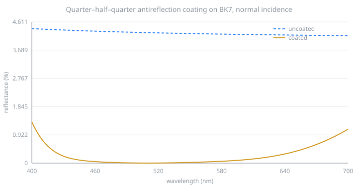
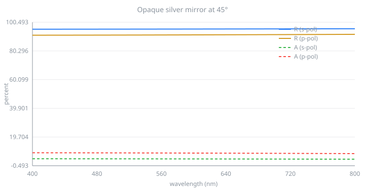
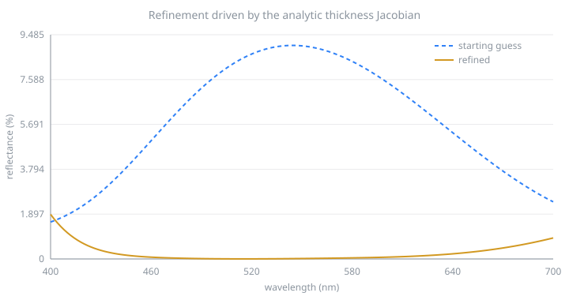

# Examples

Every script here is runnable from a clone, and every figure was written by the
script beside it. Continuous integration regenerates them and fails the build if
any differ.

```bash
git clone https://github.com/aai2k/tmmcore
cd tmmcore
node examples/01-single-layer.mjs
```

---

## A single layer, against the closed form

`examples/01-single-layer.mjs`

One quarter-wave layer on a substrate at normal incidence has an exact solution:

$$R = \left(\frac{n_0 n_s - n_1^2}{n_0 n_s + n_1^2}\right)^2$$

Macleod, *Thin-Film Optical Filters* 5th ed., §3.2. It is the simplest case
where a transfer-matrix implementation can be checked against something that is
not another transfer-matrix implementation.

```
quarter-wave thickness   99.6377 nm
R from tmmcore           0.012600790214630274
R closed form            0.012600790214630288
difference               1.39e-17
R + T + A                1.0000000000000000

bare glass R             4.26 %
coated R                 1.26 %
```

The disagreement is below double-precision epsilon.

---

## An antireflection coating

`examples/02-ar-coating.mjs`

The classic quarter–half–quarter design: a quarter-wave of low index facing air,
a half-wave of high index, a quarter-wave of intermediate index against the
substrate. The half-wave layer is an absentee at the reference wavelength and
flattens the response either side of it.



```
mean R, bare glass   4.245 %
mean R, coated       0.248 %
peak R, coated       1.348 %
```

The dispersion functions are Cauchy-style approximations chosen to be
representative. Real work uses measured n,k. tmmcore takes the index at the
wavelength you are evaluating and has no opinion on where it came from.

---

## A metal mirror at oblique incidence

`examples/03-metal-mirror.mjs`

Metals are where transfer-matrix implementations are most likely to diverge: k
is large, the phase thickness is strongly complex, and the field decays within
tens of nanometres. At 45° the s and p responses separate, and absorptance shows
it most clearly.



```
           Rs %     Rp %     As %     Ap %
400 nm   95.587   91.369   4.413   8.631
550 nm   95.665   91.518   4.335   8.482
700 nm   95.799   91.774   4.201   8.225

max transmittance through 120 nm of silver: 1.73e-6
```

"Opaque" is a judgement about a number, and how small the number needs to be
depends on your design, so the example prints it rather than assuming it.

---

## Refinement with the analytic Jacobian

`examples/04-refine.mjs`

`tmmThicknessJacobian` returns $\partial R/\partial d_j$ for every layer,
exactly, from the same matrix product that produced $R$. No other
transfer-matrix package offers this.

The example starts from a deliberately poor guess and runs damped Gauss–Newton
against a target of zero reflectance across the visible. Residuals are
$R(\lambda_i)$; Jacobian rows are $\partial R(\lambda_i)/\partial d_j$.



```
start        mean R = 6.6880 %   d = [70.00,150.00,40.00]
iteration  1  mean R = 2.9619 %   d = [70.43,125.94,107.89]
iteration  2  mean R = 0.8692 %   d = [87.68,129.27,96.63]
iteration  3  mean R = 0.4146 %   d = [93.12,125.63,86.82]
iteration 10  mean R = 0.2491 %   d = [93.64,114.88,72.62]
iteration 16  mean R = 0.2350 %   d = [93.35,117.34,74.56]

refined      mean R = 0.2348 %   d = [93.62,117.56,75.42]
```

The optimizer converges to `[93.6, 117.6, 75.4]` nm. The textbook
quarter–half–quarter design for these materials is `[92.4, 115.9, 75.0]` nm.

A finite-difference Jacobian would need one extra spectrum evaluation per layer
per iteration. Here the derivatives arrive with the spectrum. For a three-layer
stack that is a factor of four; for a forty-layer stack it is a factor of
forty-one.

---

## Where to go next

- [API reference](api.md), every function and what it returns
- [Validation](validation.md), reproducing the accuracy figures yourself
- The needle P-function, `tmmNeedleScan`, extends the idea above from optimizing
  thicknesses to deciding *where a new layer should go*. That is the basis of
  needle synthesis; [TFStudio](https://github.com/aai2k/TFStudio) builds a full
  design environment on it.
