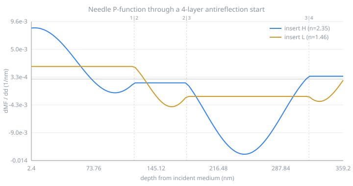
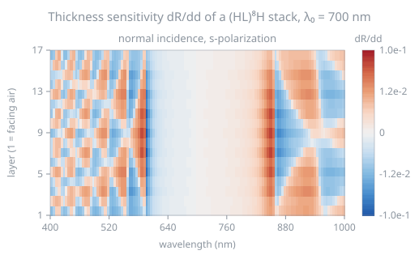

# Examples

Every script here is runnable from a clone, and every figure was written by the
script beside it. Continuous integration regenerates them and fails the build if
any differ.

```bash
git clone https://github.com/aai2k/tmmcore
cd tmmcore
node examples/01-single-layer.mjs
```

---

## A single layer, against the closed form

`examples/01-single-layer.mjs`

One quarter-wave layer on a substrate at normal incidence has an exact solution:

$$R = \left(\frac{n_0 n_s - n_1^2}{n_0 n_s + n_1^2}\right)^2$$

Macleod, *Thin-Film Optical Filters* 5th ed., §3.2. It is the simplest case
where a transfer-matrix implementation can be checked against something that is
not another transfer-matrix implementation.

```
quarter-wave thickness   99.6377 nm
R from tmmcore           0.012600790214630274
R closed form            0.012600790214630288
difference               1.39e-17
R + T + A                1.0000000000000000

bare glass R             4.26 %
coated R                 1.26 %
```

The disagreement is below double-precision epsilon.

---

## An antireflection coating

`examples/02-ar-coating.mjs`

The classic quarter–half–quarter design: a quarter-wave of low index facing air,
a half-wave of high index, a quarter-wave of intermediate index against the
substrate. The half-wave layer is an absentee at the reference wavelength and
flattens the response either side of it.


```
mean R, bare glass   4.245 %
mean R, coated       0.248 %
peak R, coated       1.348 %
```

The dispersion functions are Cauchy-style approximations chosen to be
representative. Real work uses measured n,k. tmmcore takes the index at the
wavelength you are evaluating and has no opinion on where it came from.

---

## A metal mirror at oblique incidence

`examples/03-metal-mirror.mjs`

Metals are where transfer-matrix implementations are most likely to diverge: k
is large, the phase thickness is strongly complex, and the field decays within
tens of nanometres. At 45° the s and p responses separate, and absorptance shows
it most clearly.


```
           Rs %     Rp %     As %     Ap %
400 nm   95.587   91.369   4.413   8.631
550 nm   95.665   91.518   4.335   8.482
700 nm   95.799   91.774   4.201   8.225

max transmittance through 120 nm of silver: 1.73e-6
```

"Opaque" is a judgement about a number, and how small the number needs to be
depends on your design, so the example prints it rather than assuming it.

---

## Wavelength against angle of incidence

`examples/05-angle-map.mjs`

A quarter-wave stack, `(HL)⁸H` with λ₀ = 700 nm, swept over 400–1000 nm and
0–80° in both polarizations.


The high-reflectance zone bends toward shorter wavelengths as the stack is
tilted. The phase thickness at oblique incidence is $\delta = 2\pi n d \cos\theta / \lambda$,
which reads as an apparent optical thickness $nd\cos\theta$, so the layers behave
as though they were thinner when tilted (Macleod, *Thin-Film Optical Filters*
5th ed., ch. 8, "Simple Tilts in Collimated Light"). For the quarter-wave stack
specifically: "As the multilayer is tilted to greater angles of incidence, the
characteristic moves to a shorter wavelength" (ch. 10, One-Dimensional Photonic
Crystals).

```
R >= 0.9 band, nm
  AOI      s-pol           p-pol
   0°   605-830         605-830
  30°   575-810         590-785
  45°   540-785         570-730
  60°   505-765         555-675

s-pol band centre moves 83 nm to the blue between 0° and 60° (717.5 -> 635 nm).

reference points
   700 nm   0°  s   R = 0.999457736995
   550 nm   0°  s   R = 0.092532958768
   450 nm   0°  s   R = 0.049112277617
   700 nm  45°  s   R = 0.999740289709
   700 nm  45°  p   R = 0.988233906498
   600 nm  60°  s   R = 0.999971652485
   600 nm  60°  p   R = 0.987906648644
```

The two polarizations are identical at normal incidence and separate as the
angle grows, with the p-polarized zone narrowing faster. Indices are
non-dispersive here so that the tilt is the only effect in view, which also
makes the design trivial to reproduce in another tool: air, then 17 alternating
quarter waves starting and ending with H, on a substrate of index 1.52.

The reference points are point samples at full precision, so they can be checked
against another implementation without depending on where a band edge happens to
fall on the grid.

The figure itself averages R over each cell's wavelength bin. The sidelobe
fringes on the short-wavelength side are narrower than one cell, and point
sampling would alias them into speckle; the average is what a spectrophotometer
of finite bandwidth measures.

---

## Refinement with the analytic Jacobian

`examples/04-refine.mjs`

`tmmThicknessJacobian` returns $\partial R/\partial d_j$ for every layer,
exactly, from the same matrix product that produced $R$. No other
transfer-matrix package offers this.

The example starts from a deliberately poor guess and runs damped Gauss–Newton
against a target of zero reflectance across the visible. Residuals are
$R(\lambda_i)$; Jacobian rows are $\partial R(\lambda_i)/\partial d_j$.


```
start        mean R = 6.6880 %   d = [70.00,150.00,40.00]
iteration  1  mean R = 2.9619 %   d = [70.43,125.94,107.89]
iteration  2  mean R = 0.8692 %   d = [87.68,129.27,96.63]
iteration  3  mean R = 0.4146 %   d = [93.12,125.63,86.82]
iteration 10  mean R = 0.2491 %   d = [93.64,114.88,72.62]
iteration 16  mean R = 0.2350 %   d = [93.35,117.34,74.56]

refined      mean R = 0.2348 %   d = [93.62,117.56,75.42]
```

The optimizer converges to `[93.6, 117.6, 75.4]` nm. The textbook
quarter–half–quarter design for these materials is `[92.4, 115.9, 75.0]` nm.

A finite-difference Jacobian would need one extra spectrum evaluation per layer
per iteration. Here the derivatives arrive with the spectrum. For a three-layer
stack that is a factor of four; for a forty-layer stack it is a factor of
forty-one.

---

## The needle P-function: where the next layer goes

`examples/06-needle.mjs`

`tmmNeedleScan` returns the derivative of each spectral quantity with respect to
inserting an infinitesimally thin layer of a candidate material, at every
position in the stack at once. Chain that through a merit function and you get
P(z), whose most negative point is the best place to insert.



Starting from a deliberately mediocre four-layer antireflection design, with
mean R² over 450–650 nm as the merit function:

```
start design, 4 layers, 360 nm total
merit (mean R^2 over 450-650 nm) = 1.1956e-1

most negative P: -1.2562e-2 /nm
  candidate H (n=2.35) at depth 247.2 nm from the incident medium
```

P is the $d \to 0$ limit of Sullivan and Dobrowolski's numerical pre/post method
(*Appl. Opt.* **35**, 5484, 1996), the analytic P-function of Tikhonravov et al.
(*Appl. Opt.* **35**, 5493, 1996). Unlike the numerical form it needs no trial
thickness and no second spectrum evaluation.

Being a limit, it is checkable. Insert a needle of thickness $\varepsilon$ at
that point and the numerical slope has to converge to it:

```
   eps (nm)   (MF(eps) - MF(0)) / eps        ratio to analytic
   1          -1.221337e-2              0.972233
   0.1        -1.252856e-2              0.997324
   0.01       -1.255883e-2              0.999734
   0.001      -1.256184e-2              0.999973
```

---

## Which layer controls which wavelength

`examples/07-jacobian-map.mjs`

`tmmThicknessJacobian` returns $\partial R/\partial d_j$ for every layer in the
same call that produces R. Sweeping over wavelength gives a sensitivity map of
the quarter-wave reflector from the angle example: one row per layer, one column
per wavelength, signed.



```
largest |dR/dd| over the grid: 9.9781e-2 /nm

peak |dR/dd| inside the 620-800 nm zone : 6.5219e-4 /nm
peak |dR/dd| anywhere on the grid       : 9.9781e-2 /nm
ratio                                   : 153.0x
```

Deep inside the high-reflectance zone R is pinned near 1, so no layer can move
it and the map goes neutral. All the leverage sits at the band edges and in the
sidelobes, which is why refining a reflector means working on its edges.

The colour scale is a signed cube root. Those two band edges carry derivatives
150 times larger than anything else, and on a linear scale 87% of the map
renders as blank neutral; the cube root keeps the sign, compresses the peaks and
opens up the sidelobe structure. The colour bar is labelled accordingly.

Verified against a central difference at a band edge, where the derivative is
largest:

```
analytic dR/dd against a central difference at 615 nm, h = 1e-4 nm
  layer    analytic          central diff      rel. difference
      1    -4.932399e-4    -4.932399e-4    4.9e-9
      5    -1.191639e-3    -1.191639e-3    9.9e-10
      9    -1.366824e-3    -1.366824e-3    2.6e-9
     17    -3.083978e-4    -3.083978e-4    8.4e-9
```

---

## Where to go next

- [API reference](api.md), every function and what it returns
- [Validation](validation.md), reproducing the accuracy figures yourself
- The needle P-function, `tmmNeedleScan`, extends the idea above from optimizing
  thicknesses to deciding *where a new layer should go*. That is the basis of
  needle synthesis; [TFStudio](https://github.com/aai2k/TFStudio) builds a full
  design environment on it.
