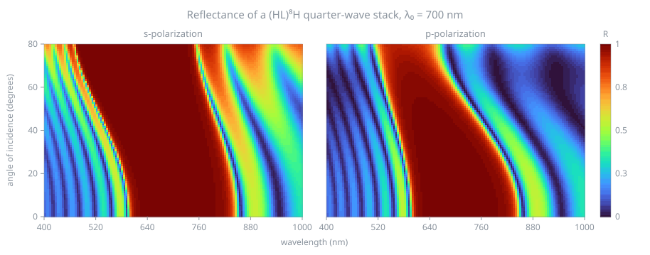

# tmmcore

Transfer-matrix method for multilayer thin-film optics, with exact analytic derivatives.

Takes a stack of layers and returns reflectance, transmittance and absorptance
for absorbing and dispersive materials, at any angle of incidence, in s and p
polarization. Alongside the spectra it returns the exact thickness Jacobian, the
exact thickness Hessian, and the needle-insertion P-function.



<div class="grid cards" markdown>

-   __Analytic derivatives__

    Exact thickness Jacobian, exact thickness Hessian, and the needle
    P-function, computed analytically rather than by finite differences or
    autodiff. The reason to pick tmmcore if you are building an optimizer.

-   __Runs in a browser__

    JavaScript and WebAssembly, working in Node and on the web. The JavaScript
    path has no dependencies and works on import.

-   __Portable C99__

    The kernel is a single C file needing nothing beyond libm. Drop it into a
    C or C++ project and compile it.

-   __Checkable__

    Two commands reproduce the accuracy claims on your machine.

</div>

## Install

```bash
npm install tmmcore
```

The WebAssembly binary is prebuilt and included, so no Emscripten toolchain is
required.

## A first calculation

```js
import { tmm } from 'tmmcore';

// A quarter-wave MgF2 layer on glass, at 550 nm, normal incidence.
const { R, T, A } = tmm(
    550,                            // wavelength, nm
    0,                              // angle of incidence, degrees
    's',                            // polarization
    [1.0, 0],                       // incident medium, ñ = [n, k]
    [1.52, 0],                      // substrate
    [{ n: [1.38, 0], d: 550 / (4 * 1.38) }]   // quarter wave, thickness in nm
);

console.log(R);   // 0.012600790214630274
```

That value has a closed form, $R = \left(\frac{n_0 n_s - n_1^2}{n_0 n_s + n_1^2}\right)^2$,
and tmmcore reproduces it to $1.4\times10^{-17}$. See
[Validation](validation.md).

## Implementations

| | |
|---|---|
| **JavaScript** | The reference implementation. No dependencies, works everywhere. |
| **C** | A line-by-line port of the JavaScript. C99, libm only. |
| **WebAssembly** | The C, compiled. Opt-in, roughly an order of magnitude faster. |

The JavaScript is the behavioural reference and the C must match it to float64
round-off. `npm test` checks that agreement.

## Scope

Incoherent layers, ellipsometric parameters, and material databases are out of
scope. tmmcore is the calculation kernel; those belong in the application above
it. For a full design environment, see
[TFStudio](https://github.com/aai2k/TFStudio).

## Licence

MIT.
